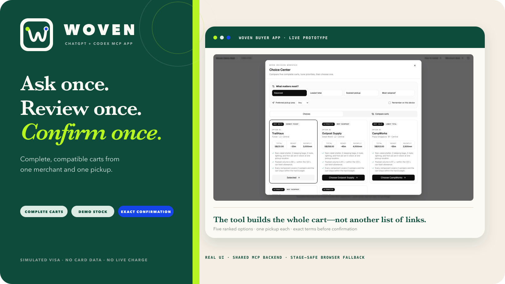
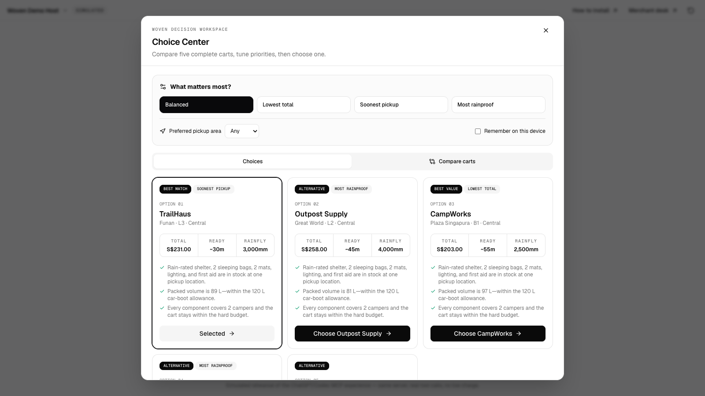
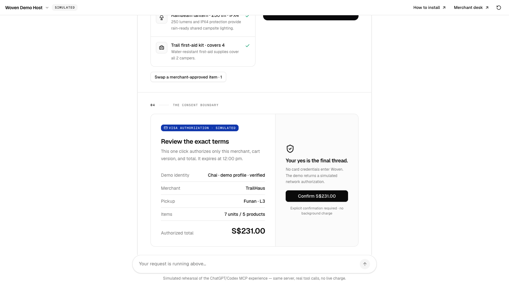
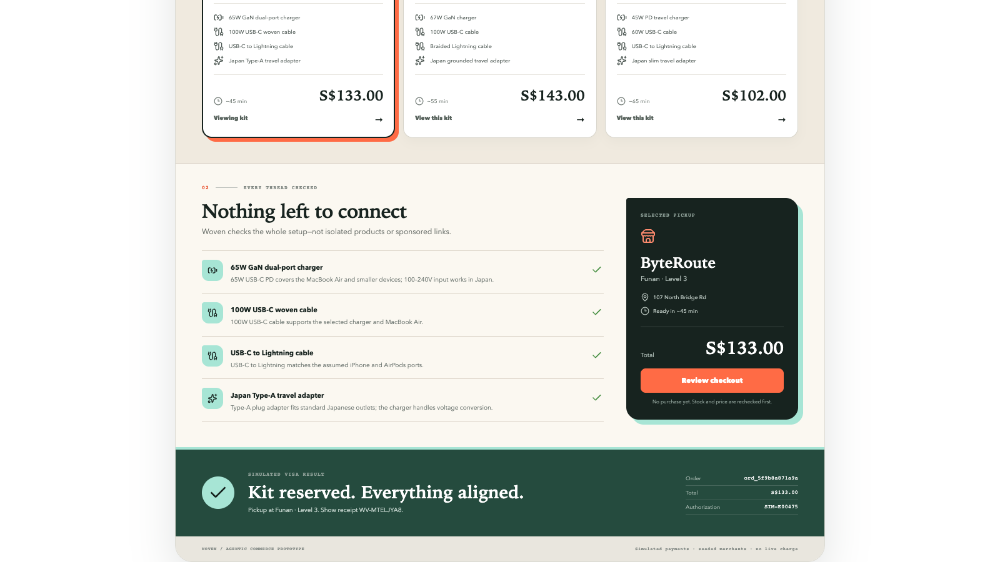
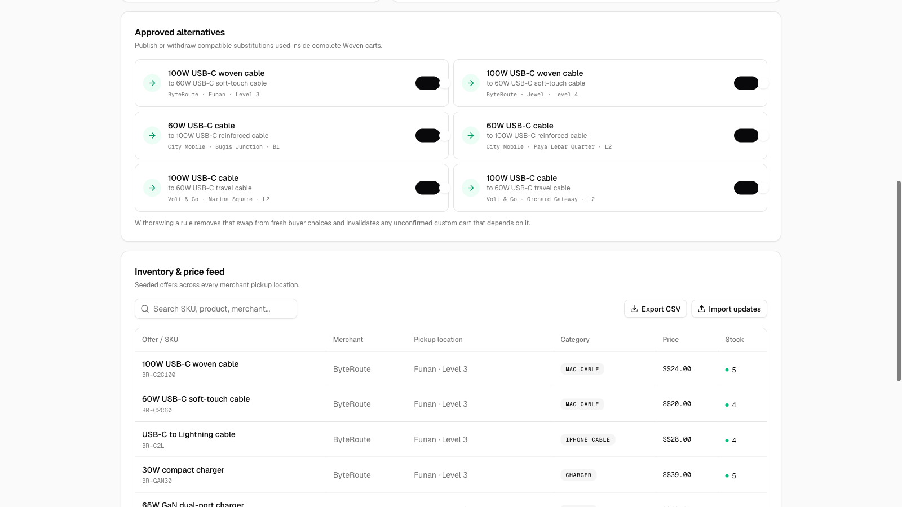
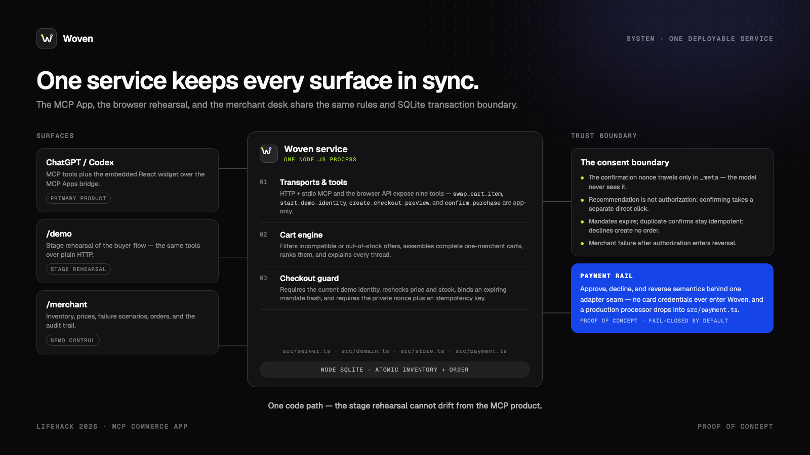
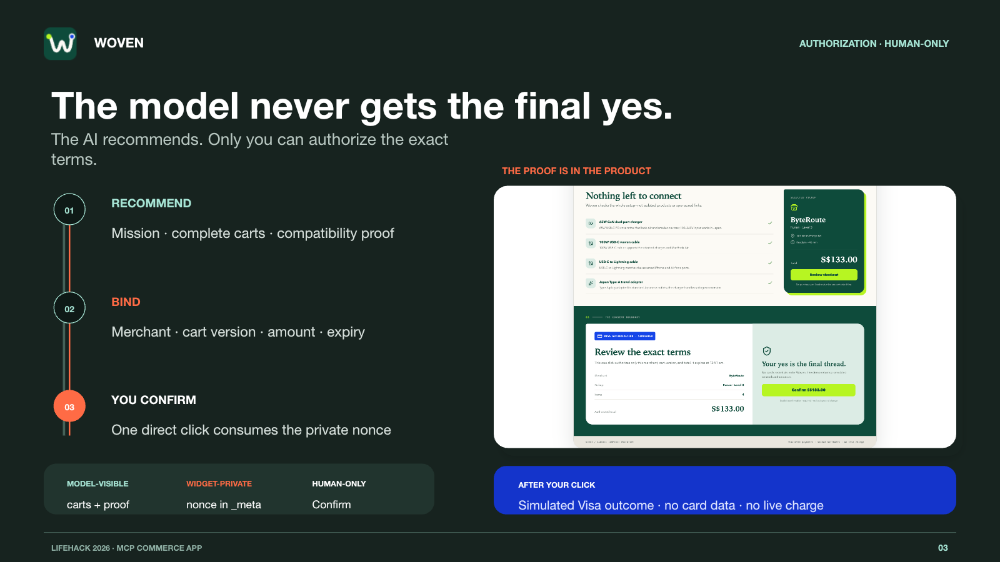

<a id="readme-top"></a>

<div align="center">
  

  <h1>Woven</h1>

  <p><strong>Everything works together.</strong></p>

  <p>
    A shopping app inside ChatGPT and Codex that turns one request into a
    complete, compatible cart—then waits for the user to approve the exact
    purchase before a simulated Visa authorization.
  </p>

  <p><em>Ask once. Review once. Confirm once.</em></p>

  <p>
    <a href="https://github.com/Ducksss/LifeHack-2026/actions/workflows/ci.yml"></a>
    
    
    
    
  </p>

  <p>
    <a href="docs/INSTALLATION.md"><strong>Install Woven</strong></a>
    ·
    <a href="#getting-started">Run the demo</a>
    ·
    <a href="docs/PRD.md">Product requirements</a>
    ·
    <a href="docs/architecture.md">Technical architecture</a>
    ·
    <a href="docs/DEVPOST_SUBMISSION.md">Devpost submission kit</a>
    ·
    <a href="script.md">3-minute pitch</a>
    ·
    <a href="https://github.com/Ducksss/LifeHack-2026/issues">Report an issue</a>
  </p>
</div>



> [!IMPORTANT]
> Woven is a hackathon prototype. Merchants, inventory, prices, and Visa
> authorization responses are seeded or simulated. It collects no card
> credentials and cannot make a live charge.

<details>
  <summary>Table of contents</summary>
  <ol>
    <li><a href="#about-the-project">About the project</a></li>
    <li><a href="#why-chatgpt-why-a-plugin">Why ChatGPT and why a plugin?</a></li>
    <li><a href="#how-it-works">How it works</a></li>
    <li><a href="#the-three-minute-story">The three-minute story</a></li>
    <li><a href="#product-gallery">Product gallery</a></li>
    <li><a href="#architecture">Architecture</a></li>
    <li><a href="#built-with">Built with</a></li>
    <li><a href="#getting-started">Getting started</a></li>
    <li><a href="#usage">Usage</a></li>
    <li><a href="#trust-and-safety">Trust and safety</a></li>
    <li><a href="#testing">Testing</a></li>
    <li><a href="#roadmap">Roadmap</a></li>
    <li><a href="#contributing">Contributing</a></li>
    <li><a href="#license">License</a></li>
    <li><a href="#contact">Contact</a></li>
    <li><a href="#acknowledgments">Acknowledgments</a></li>
  </ol>
</details>

## About the project

**Search gives you links. Buying still takes work.**

Imagine flying tonight and needing a charger for three devices. You still have
to compare products, check compatibility, find one store with everything in
stock, and rebuild the cart at checkout.

Woven finishes that job inside the AI workflow the user already uses. Ask
ChatGPT or Codex once and Woven returns complete carts from one pickup location,
shows why every item works together, rechecks the price and stock, and waits for
a separate human confirmation before authorization.

The canonical mission is deliberately concrete:

> I fly to Tokyo tonight. Build a charging kit for my MacBook Air, iPhone and
> AirPods under S$150, with pickup today.

### Why it is different

| Product search | Woven |
| --- | --- |
| Ranks individual items | Ranks complete, compatible carts |
| Leaves stock and pickup implicit | Uses current demo stock and pickup timing |
| May mix merchants | Returns one pickup location per cart |
| Makes the user reconstruct compatibility | Shows a proof for every component |
| Blurs recommendation and purchase | Requires an exact, expiring confirmation |

<p align="right">(<a href="#readme-top">back to top</a>)</p>

## Why ChatGPT? Why a plugin?

The shopping request already exists in the conversation. A standalone app would
make the user repeat it, while Woven can turn that same request into bounded
merchant actions and return a structured checkout for review.

The primary product is a real MCP App/plugin inside ChatGPT or Codex. The model
can ask Woven to build carts, but app-only tools and a direct user click protect
checkout. The `/demo` browser route is a stage-safe rehearsal of that
experience: a clearly labeled simulated chat host that types the canonical
request, shows every MCP tool call live, and drives the same backend. It is
marked “Simulated” on screen and is not a second product.

<p align="right">(<a href="#readme-top">back to top</a>)</p>

## How it works

1. **Ask once.** The host calls `start_mission` with the user's
   budget, destination, devices, and pickup constraint.
2. **Build complete carts.** Woven rejects incompatible or unavailable
   offers, stays under budget, and ranks one-merchant options.
3. **Show the proof.** The MCP App widget explains charger wattage, voltage,
   cable connectors, adapter fit, live demo stock, total, and pickup time.
4. **Review once.** The server rechecks price and stock and creates a
   ten-minute mandate bound to the merchant, cart version, and amount.
5. **Confirm once.** A private nonce, mandate hash, and idempotency key are
   verified before the simulated authorization and merchant order.

The AI recommends. The user chooses. Woven binds the exact terms.


<p align="right">(<a href="#readme-top">back to top</a>)</p>

## The three-minute story

```text
Ask once
   ↓
Receive complete one-merchant carts
   ↓
See why everything works together
   ↓
Review the exact merchant, items, pickup, and total
   ↓
Confirm once
   ↓
Receive a simulated Visa result and pickup receipt
```

The proposed next trust step is a **simulated connector-style identity check**
before checkout. It is intentionally not shown as a working feature yet: the
current prototype has no Visa login, user account, or identity-provider
integration. When built, it must remain separate from final purchase
confirmation and must never collect Visa credentials or card data.

See [`script.md`](script.md) for the exact narration, stage actions, fallback
path, and the identity insert that becomes usable only after implementation.

<p align="right">(<a href="#readme-top">back to top</a>)</p>

## Product gallery

<table>
  <tr>
    <td width="50%"></td>
    <td width="50%"></td>
  </tr>
  <tr>
    <td><strong>Born inside the chat.</strong><br>One message becomes a live MCP app — visible tool calls, then three complete carts.</td>
    <td><strong>A visible authorization boundary.</strong><br>The exact merchant, pickup, items, and total are bound before confirmation.</td>
  </tr>
  <tr>
    <td></td>
    <td></td>
  </tr>
  <tr>
    <td><strong>A pickup-ready result.</strong><br>The user receives a simulated authorization result and receipt.</td>
    <td><strong>A controllable live demo.</strong><br>Inventory, pricing, declines, order failures, and the audit trail are visible on stage.</td>
  </tr>
</table>

<p align="right">(<a href="#readme-top">back to top</a>)</p>

## Architecture



Woven is one deployable Node.js service. The MCP transports, browser
fallback, and merchant desk all route through the same domain and persistence
functions. The real payment integration boundary is isolated in
`src/payment.ts`; the current adapter intentionally fails closed unless
`PAYMENT_MODE=simulated`.

Detailed tool contracts, state transitions, cart rules, and trust boundaries
are documented in [the architecture guide](docs/architecture.md).

<p align="right">(<a href="#readme-top">back to top</a>)</p>

## Built with

- [TypeScript](https://www.typescriptlang.org/) and [Node.js](https://nodejs.org/)
- [React](https://react.dev/) and [Vite](https://vite.dev/)
- [Tailwind CSS](https://tailwindcss.com/) and [shadcn/ui](https://ui.shadcn.com/)
- [Model Context Protocol SDK](https://modelcontextprotocol.io/)
- [MCP Apps](https://github.com/modelcontextprotocol/ext-apps)
- [Express](https://expressjs.com/)
- Node's built-in [SQLite](https://nodejs.org/api/sqlite.html)
- [Zod](https://zod.dev/)

<p align="right">(<a href="#readme-top">back to top</a>)</p>

## Getting started

### Prerequisites

- Node.js 22.5 or newer
- npm

### Installation

For the exact Codex desktop, Codex CLI, and ChatGPT Developer Mode steps—with
expected output and troubleshooting—use the
**[installation and verification guide](docs/INSTALLATION.md)**.

```bash
git clone https://github.com/Ducksss/LifeHack-2026.git
cd LifeHack-2026
npm ci
npm run check
npm start
```

Open the local surfaces:

| Surface | URL |
| --- | --- |
| Landing page | <http://localhost:8787/> |
| Buyer fallback | <http://localhost:8787/demo> |
| Merchant desk | <http://localhost:8787/merchant> |
| MCP endpoint | <http://localhost:8787/mcp> |
| Health check | <http://localhost:8787/healthz> |

### Connect the ChatGPT app

Follow the [ChatGPT connection guide](docs/INSTALLATION.md#3-connect-woven-to-chatgpt).
It covers the required public HTTPS endpoint, Developer Mode setup, discovered
tools, and expected widget result. ChatGPT cannot connect to localhost.

Current OpenAI references: [plugin quickstart][openai-quickstart], [MCP server
guide][openai-mcp], [ChatGPT UI guide][openai-ui], and [connection
guide][openai-connect].

### Connect the Codex plugin

Follow the [local Codex installation guide](docs/INSTALLATION.md#2-recommended-install-in-codex-desktop).
The repository includes a **Woven Local** marketplace entry; its bundled stdio
server serves widget assets on port `8788`, separate from the HTTP demo.

<p align="right">(<a href="#readme-top">back to top</a>)</p>

## Usage

### Happy-path demo

Use the complete [three-minute stage script](script.md). The working happy path
is:

1. Open `/demo` — the simulated chat host types the canonical request, plays the
   `start_mission` activity, and renders the widget with three ranked carts.
2. Select a kit and inspect its compatibility proof.
3. Click **Review checkout** to force a stock and price recheck.
4. Call out the exact, expiring mandate and click **Confirm S$133.00**.
5. Show the simulated Visa result and pickup receipt.

### Trust/failure demo

Use `/merchant` to select a scenario, then replay checkout:

- **Stockout** or **Price change** invalidates an old preview.
- **Auth decline** creates no merchant order.
- **Order failure** enters reversal after simulated authorization.
- **Reset demo data** restores stock and clears the local run.

### Catalog updates

The merchant desk exports and imports a deliberately small CSV contract:

```csv
offer_id,price_sgd,stock
byteroute-funan-br-gan65,69.00,4
```

Imports update only known offers and reject malformed prices, negative values,
and fractional stock. A demo upload cannot silently create incompatible SKUs.

### Commands

```bash
npm run dev          # Vite UI development server
npm run dev:server   # API/MCP server with restart-on-change
npm run build        # production bundle + TypeScript validation
npm test             # domain, security, idempotency, failure, and CSV checks
npm run check        # full test and build gate
npm run mcp          # stdio MCP transport used by the Codex plugin
```

### Configuration

| Variable | Default | Purpose |
| --- | --- | --- |
| `PORT` | `8787` | HTTP server port |
| `BASE_URL` | `http://localhost:8787` | Public widget asset/CSP origin |
| `WOVEN_DB` | `./data/woven.db` | SQLite demo state |
| `PAYMENT_MODE` | `simulated` | Guardrail; every other value fails closed |

<p align="right">(<a href="#readme-top">back to top</a>)</p>

## Trust and safety

- No PAN, CVV, wallet token, or payment credential is accepted or stored.
- The one-time confirmation nonce stays in MCP result `_meta`, private to the
  widget rather than visible to the model.
- Every preview is bound to the exact cart version, merchant, amount, and expiry.
- Price and stock are revalidated inside the same SQLite write transaction as
  order creation and inventory decrement.
- Duplicate confirmation returns the original result through idempotency.
- Simulated rail and merchant failures are visibly labeled and auditable.

> [!NOTE]
> The connector-style identity screen in the target storyboard is roadmap work,
> not a current product claim. Today, Woven protects the transaction with an
> exact, expiring mandate and a separate direct confirmation; it does not verify
> a Visa identity or perform KYC.



<p align="right">(<a href="#readme-top">back to top</a>)</p>

## Testing

```bash
npm run check
npm audit
```

The automated suite covers cart completeness and ranking, mandate integrity,
stale price/stock rejection, one-time nonce consumption, idempotent confirmation,
authorization decline, reversal, inventory updates, and CSV validation. CI runs
the full test and production-build gate on every push and pull request.

<p align="right">(<a href="#readme-top">back to top</a>)</p>

## Roadmap

- [x] Complete one-merchant cart construction and compatibility proof
- [x] ChatGPT/Codex MCP App widget plus HTTP rehearsal fallback
- [x] Exact, expiring, one-time checkout mandate
- [x] Merchant inventory, scenario controls, CSV update, and audit trail
- [x] Simulated authorization, decline, order failure, and reversal paths
- [x] End-to-end tests and submission-ready gallery
- [ ] Simulated connector-style identity check, enforced before checkout
- [ ] Public HTTPS deployment and shareable ChatGPT app connection
- [ ] Real merchant inventory/fulfilment connectors
- [ ] Exact Visa sandbox product adapter after credentials and product approval
- [ ] Generalized missions beyond the Tokyo charging-kit vertical

See the [open issues](https://github.com/Ducksss/LifeHack-2026/issues) for scoped
work.

<p align="right">(<a href="#readme-top">back to top</a>)</p>

## Contributing

This is currently a private hackathon repository. Collaborators should open an
issue describing the user-visible change, create a focused branch, run
`npm run check`, and submit a pull request with screenshots for UI changes.

<p align="right">(<a href="#readme-top">back to top</a>)</p>

## License

No open-source license has been granted. All rights are reserved by the project
contributors unless a license is added later.

<p align="right">(<a href="#readme-top">back to top</a>)</p>

## Contact

Project repository: [Ducksss/LifeHack-2026](https://github.com/Ducksss/LifeHack-2026)

<p align="right">(<a href="#readme-top">back to top</a>)</p>

## Acknowledgments

- README organization was adapted to this project from the
  [Best README Template][best-readme-template].
- Devpost story and gallery sequencing were informed by
  [AquaWise's Devpost submission][aquawise-devpost].
- Product documentation: [installation](docs/INSTALLATION.md),
  [PRD](docs/PRD.md), [architecture](docs/architecture.md),
  [AI handover](docs/HANDOVER.md), [Devpost kit](docs/DEVPOST_SUBMISSION.md),
  [three-minute script](script.md),
  [pitch deck](docs/Woven-Hackathon-Pitch.pptx), and [brand guide](docs/BRAND_GUIDE.md).

<p align="right">(<a href="#readme-top">back to top</a>)</p>

[aquawise-devpost]: https://devpost.com/software/aquawise
[best-readme-template]: https://github.com/othneildrew/Best-README-Template
[openai-connect]: https://developers.openai.com/plugins/deploy/connect-chatgpt
[openai-mcp]: https://developers.openai.com/plugins/build/mcp-server
[openai-quickstart]: https://developers.openai.com/plugins/quickstart
[openai-ui]: https://developers.openai.com/plugins/build/chatgpt-ui
