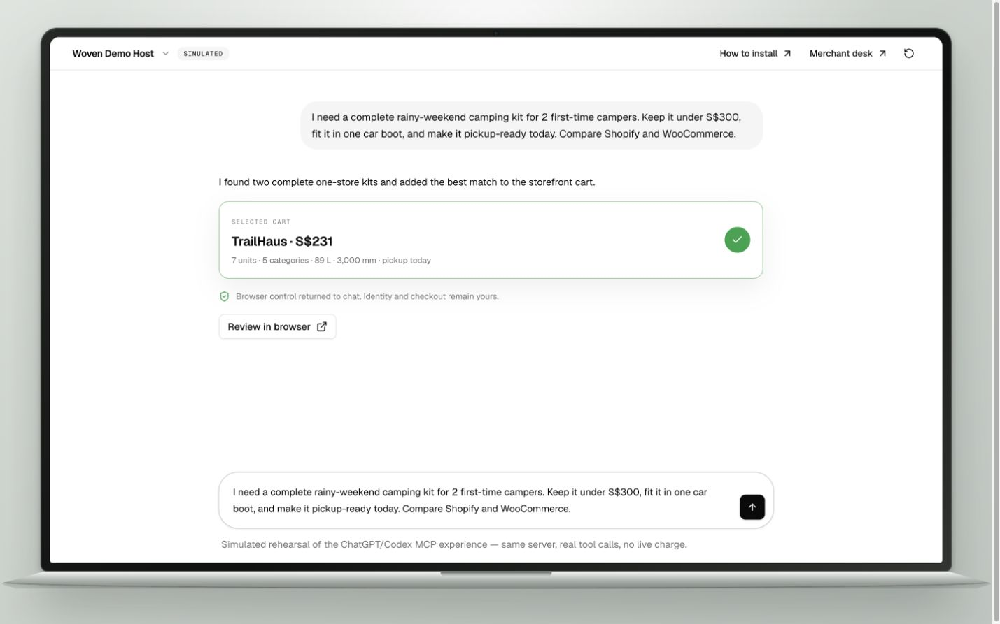
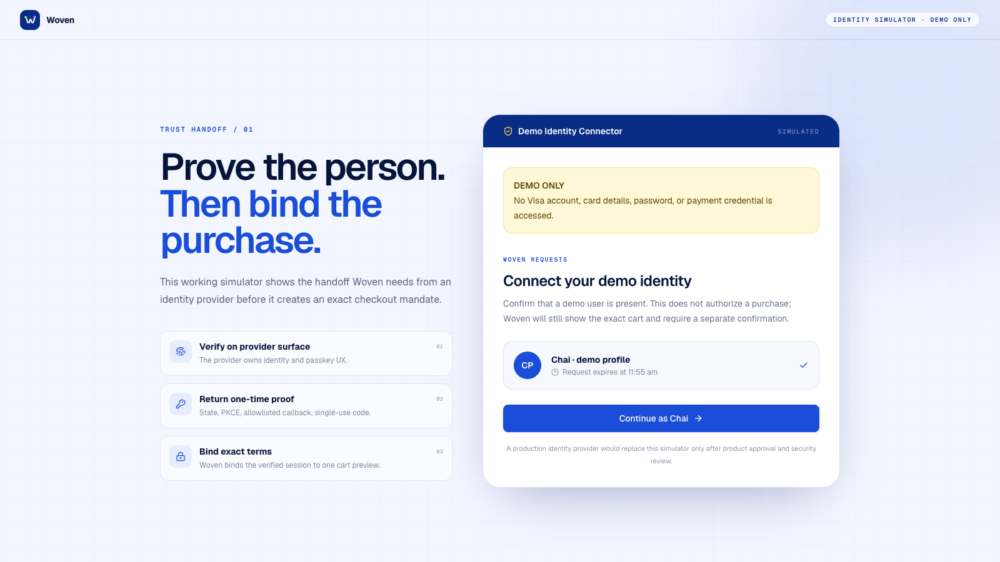
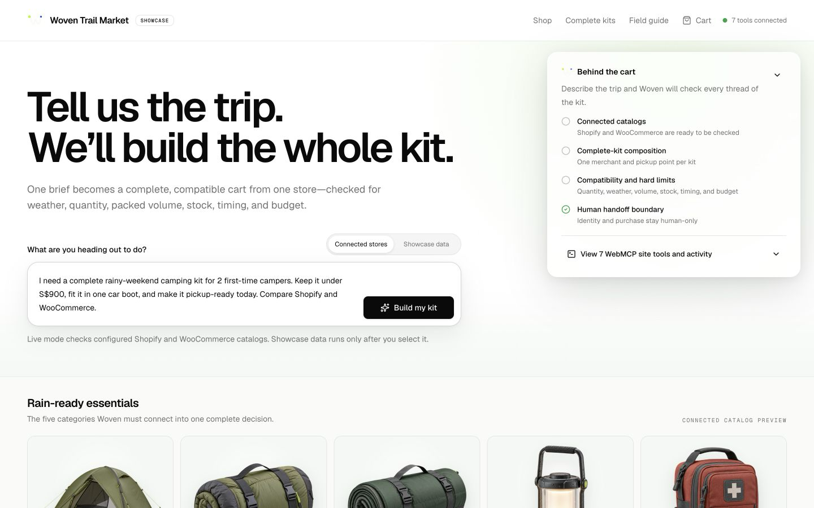
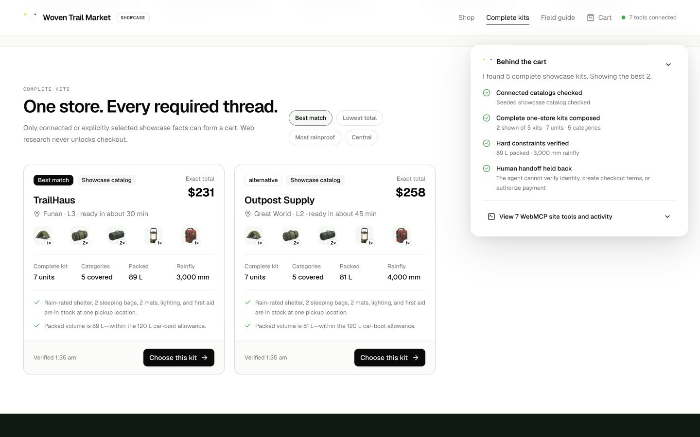
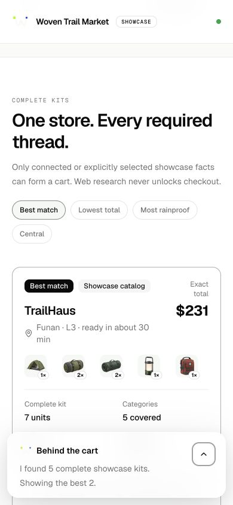

<a id="readme-top"></a>

<div align="center">
  

  <h1>Woven</h1>

  <p><strong>Everything works together.</strong></p>

  <p>
    An agentic-commerce app inside ChatGPT and Codex, backed by bounded mission
    orchestration and deterministic checkout controls. One request becomes a
    complete cart; only the user can approve the exact purchase.
  </p>

  <p><em>Ask once. Review once. Confirm once.</em></p>

  <p>
    <a href="https://github.com/Ducksss/LifeHack-2026/actions/workflows/ci.yml"></a>
    
    
    
    
    
    
  </p>

  <p>
    <a href="https://visa-woven.vercel.app"><strong>Open Woven</strong></a>
    ·
    <a href="https://visa-woven.vercel.app/demo">Run the live demo</a>
    ·
    <a href="docs/WEBMCP_DEVPOST_SUBMISSION.md"><strong>WebMCP challenge kit</strong></a>
    ·
    <a href="docs/INSTALLATION.md"><strong>Install Woven</strong></a>
    ·
    <a href="#getting-started">Run locally</a>
    ·
    <a href="docs/PRD.md">Product requirements</a>
    ·
    <a href="docs/architecture.md">Technical architecture</a>
    ·
    <a href="docs/DEVPOST_SUBMISSION.md">Devpost submission kit</a>
    ·
    <a href="script.md">3-minute pitch</a>
    ·
    <a href="https://visa-woven.vercel.app">Live demo</a>
    ·
    <a href="https://github.com/Ducksss/LifeHack-2026/issues">Report an issue</a>
  </p>
</div>


> [!IMPORTANT]
> Woven is a hackathon prototype. Merchants, inventory, prices, and Visa
> authorization responses are seeded or simulated. It collects no card
> credentials and cannot make a live charge.

<details>
  <summary>Table of contents</summary>
  <ol>
    <li><a href="#about-the-project">About the project</a></li>
    <li><a href="#why-chatgpt-why-a-plugin">Why ChatGPT and why a plugin?</a></li>
    <li><a href="#how-it-works">How it works</a></li>
    <li><a href="#the-three-minute-story">The three-minute story</a></li>
    <li><a href="#product-gallery">Product gallery</a></li>
    <li><a href="#architecture">Architecture</a></li>
    <li><a href="#built-with">Built with</a></li>
    <li><a href="#getting-started">Getting started</a></li>
    <li><a href="#usage">Usage</a></li>
    <li><a href="#trust-and-safety">Trust and safety</a></li>
    <li><a href="#testing">Testing</a></li>
    <li><a href="#roadmap">Roadmap</a></li>
    <li><a href="#contributing">Contributing</a></li>
    <li><a href="#license">License</a></li>
    <li><a href="#contact">Contact</a></li>
    <li><a href="#acknowledgments">Acknowledgments</a></li>
  </ol>
</details>

## About the project

**Search gives you links. Buying still takes work.**

Imagine taking two first-time campers away for a rainy weekend. You still have
to size the shelter, duplicate the sleep gear, check weather ratings, keep the
packed kit inside one car boot, find one store with everything in stock, and
rebuild the cart at checkout.

Woven finishes that job inside the AI workflow the user already uses. Ask
ChatGPT or Codex once and Woven returns complete carts from one pickup location,
opens a Choice Center to compare five options in the MCP App—or the best two in
the Woven Trail Market WebMCP storefront—shows why every item works
together, rechecks the price and stock, and waits for a separate human
confirmation before authorization.

The in-chat MCP App and browser-native WebMCP tools are interaction layers, not
the whole backend. Woven's
Node.js service owns mission routing, a bounded orchestration workflow for
non-camping requests, deterministic cart verification, SQLite state, and the
checkout trust boundary.

The canonical mission is deliberately concrete:

> I need a complete rainy-weekend camping kit for 2 first-time campers. Keep it
> under S$300, fit it in one car boot, and make it pickup-ready today.

### Why it is different

| Product search | Woven |
| --- | --- |
| Ranks individual items | Ranks complete, compatible carts |
| Leaves stock and pickup implicit | Uses current demo stock and pickup timing |
| May mix merchants | Returns one pickup location per cart |
| Makes the user reconstruct compatibility | Shows a proof for every component |
| Forces a single recommendation | Compares five complete choices and lets the user rerank them |
| Blurs recommendation and purchase | Requires an exact, expiring confirmation |

<p align="right">(<a href="#readme-top">back to top</a>)</p>

## Why ChatGPT? Why a plugin?

The shopping request already exists in the conversation. A standalone app would
make the user repeat it, while Woven can turn that same request into bounded
merchant actions and return a structured checkout for review.

The primary product is a real MCP App/plugin inside ChatGPT or Codex. The model
can ask Woven to build carts, but app-only tools and a direct user click protect
checkout. The `/demo` browser route is a stage-safe rehearsal of the strongest
cross-surface flow: the clearly labeled original LifeHack `Woven Demo Host` conversation
accepts the mission, lets Woven Trail Market take control of the presentation,
opens with an explicit **WebMCP rehearsal active** receipt, highlights reversible
browser actions, waits for the shared backend, scrolls to the verified kits,
selects the best match, stops at the human-only boundary,
and returns the exact result to chat. It is marked “Simulated” on screen, uses
explicit showcase data, registers no site tools itself, and is not a second
product. A five-beat control rail makes the story deliberate: Pause/Resume stops
presentation holds without cancelling real work, Next beat is available only
between network operations, and Replay starts a clean run.

The `/webmcp` route is a dedicated fictional outdoor storefront called **Woven
Trail Market**, visibly labeled **Showcase**. Its Shop, Complete kits, Field
guide, and Cart anchors are functional. A person can submit the hero mission or
an agent can invoke one of seven top-level WebMCP site tools; both update the
same visible kits and truthful “Behind the cart” activity surface. Identity,
exact revalidation, private merchant-cart creation, merchant continuation, and
purchase confirmation are deliberately absent from WebMCP: those remain direct
human actions in a separate solid handoff section.

Connected stores are the default. If Shopify and WooCommerce are not configured,
Woven fails closed and offers retry plus an explicit, session-local **Showcase
data** action. It never substitutes seeded products silently.

MCP supplies the host connection, tool contract, private widget metadata, and
embedded UI. After `start_mission` reaches Woven, the server—not the host
model—routes the request, runs any required orchestration, classifies evidence,
and decides whether a cart is checkout-eligible.

<p align="right">(<a href="#readme-top">back to top</a>)</p>

## How it works

1. **Ask once.** An MCP host or the WebMCP-enabled site calls `start_mission`
   with the user's mission and any structured constraints.
2. **Route and orchestrate.** The canonical camping request uses the deterministic
   engine. Other categories enter a fixed LangGraph.js workflow that interprets
   a `MissionSpec`, discovers connected offers and cited research, normalizes,
   composes, verifies, and retries at most once.
3. **Build complete carts.** Deterministic server rules reject incompatible,
   unverifiable, or unavailable offers, stay under budget, and return up to five
   one-location options. Web findings remain research-only.
4. **Compare and choose.** The MCP App Choice Center or inline storefront kits
   rerank by value, pickup speed, rain protection, or preferred area; optional
   saved preferences stay local.
5. **Show the proof.** The MCP App widget explains tent capacity and rain rating,
   two sleeping bags, two mats, lantern protection, first-aid coverage, packed
   volume, live demo stock, total, pickup plan, and approved substitutions.
6. **Verify the demo identity.** A provider-style page returns a single-use
   code; Woven validates state + PKCE and creates a short-lived server session.
7. **Review once.** The server rechecks price and stock and creates a ten-minute
   mandate bound to the identity session, merchant, cart version, and amount.
8. **Confirm once.** A private nonce, mandate hash, and idempotency key are
   verified before the simulated authorization, merchant order, and signed
   server-verifiable receipt.

The AI recommends. The user chooses. Woven binds the exact terms.

### Bounded orchestration backend

The canonical camping demo above is still deterministic and unchanged. Woven
also includes a credential-dormant TypeScript orchestration POC for non-camping
missions. This is a backend layer behind the same `start_mission` tool, not a
second MCP server or a host-model prompt convention:

- a fixed LangGraph.js flow interprets a validated `MissionSpec`, discovers
  connected and web offers in parallel, normalizes, composes, verifies, retries
  at most once, ranks, and persists;
- connected catalog offers can form checkout carts only after the server verifies
  every hard requirement, compatibility link, quantity, stock, budget, merchant,
  and pickup location;
- web results remain cited research leads with checkout disabled; and
- preview and confirmation rebuild connected carts from current SQLite catalog
  rows, preserving the existing identity, nonce, mandate, idempotency, and atomic
  inventory protections.

The POC uses the OpenAI Responses API with schema-constrained output,
`gpt-5.6-terra`, medium reasoning, built-in web search, and `store: false`. No API
credential is required for the camping demo or CI. Without `OPENAI_API_KEY`, a
non-camping mission returns retryable `AGENT_UNAVAILABLE` rather than fabricated
results. Developers who already have a key can run the opt-in live matrix with
`npm run eval:agent`.




<p align="right">(<a href="#readme-top">back to top</a>)</p>

## The three-minute story

```text
Ask once
   ↓
Receive complete one-merchant carts
   ↓
Compare five choices and tune priorities
   ↓
See why everything works together
   ↓
Verify the simulated demo identity
   ↓
Review the exact merchant, items, pickup, and total
   ↓
Confirm once
   ↓
Receive a simulated Visa result and pickup receipt
```

The working prototype includes a **simulated connector-style identity check**
before checkout. It is server-enforced but is not a Visa login, KYC, or a real
identity-provider integration. It remains separate from final purchase
confirmation and never collects Visa credentials or card data.

See [`script.md`](script.md) for the exact narration, stage actions, fallback
path, and the working identity handoff.

### Render the judge video

The repository includes a three-minute Remotion composition that follows the
authoritative script, uses the verified Woven product frames, and labels both
identity and Visa authorization as simulated.

```bash
npm run video:studio   # preview and scrub the composition
npm run video:render   # output/Woven-Judge-Video.mp4
```

The sidecar captions are in `video/Woven-Judge-Video.srt`. The bundled voice is
AI-generated with ElevenLabs and can be replaced by swapping the files in
`public/woven-video/voiceover/` without changing the timeline.

<p align="right">(<a href="#readme-top">back to top</a>)</p>

## Product gallery

<table>
  <tr>
    <td width="50%"></td>
    <td width="50%"></td>
  </tr>
  <tr>
    <td><strong>One ask becomes a visible handoff.</strong><br>The simulated chat yields to the real storefront for reversible actions, then receives the verified TrailHaus cart back while identity remains human-only.</td>
    <td><strong>A visible authorization boundary.</strong><br>The exact merchant, pickup, items, and total are bound before confirmation.</td>
  </tr>
  <tr>
    <td colspan="2"></td>
  </tr>
  <tr>
    <td colspan="2"><strong>A separate identity gate.</strong><br>The provider-style simulator creates a short-lived server session without collecting Visa, card, or payment credentials.</td>
  </tr>
  <tr>
    <td></td>
    <td></td>
  </tr>
  <tr>
    <td><strong>A pickup-ready result.</strong><br>The user receives a simulated authorization result and receipt.</td>
    <td><strong>A controllable live demo.</strong><br>Inventory, pricing, declines, order failures, and the audit trail are visible on stage.</td>
  </tr>
  <tr>
    <td colspan="2"></td>
  </tr>
  <tr>
    <td colspan="2"><strong>A storefront an agent can operate.</strong><br>The fictional Woven Trail Market opens idle, defaults to connected stores, and exposes exactly seven reversible WebMCP tools.</td>
  </tr>
  <tr>
    <td></td>
    <td></td>
  </tr>
  <tr>
    <td><strong>Complete-kit proof, not a product list.</strong><br>The canonical cart exposes 7 units, 5 categories, 89 L packed, and a 3,000 mm rainfly.</td>
    <td><strong>Mobile without a modal trap.</strong><br>The activity sheet collapses so the storefront and human actions remain reachable.</td>
  </tr>
</table>

<p align="right">(<a href="#readme-top">back to top</a>)</p>

## Architecture


Woven is one deployable Node.js service with five explicit layers: MCP/HTTP
interaction, mission routing and bounded orchestration, deterministic commerce
verification, SQLite checkout state, and the payment adapter. The browser
fallback and merchant desk enter the same backend as the MCP App. The real
payment integration boundary is isolated in `src/payment.ts`; the current
adapter intentionally fails closed unless `PAYMENT_MODE=simulated`.

LangGraph.js coordinates the non-camping workflow; OpenAI supplies structured
interpretation and cited web research; deterministic TypeScript rules decide
whether connected offers satisfy the mission; and the SQLite store revalidates
them before checkout. MCP carries inputs and results but does not own those
backend decisions.

Detailed tool contracts, state transitions, cart rules, and trust boundaries
are documented in [the architecture guide](docs/architecture.md). The live
[target-architecture explainer](https://visa-woven.vercel.app/architecture)
visualizes those boundaries without implying a current Visa integration.

<p align="right">(<a href="#readme-top">back to top</a>)</p>

## Built with

- [TypeScript](https://www.typescriptlang.org/) and [Node.js](https://nodejs.org/)
- [React](https://react.dev/) and [Vite](https://vite.dev/)
- [Tailwind CSS](https://tailwindcss.com/) and [shadcn/ui](https://ui.shadcn.com/)
- [Model Context Protocol SDK](https://modelcontextprotocol.io/)
- [MCP Apps](https://github.com/modelcontextprotocol/ext-apps)
- [Express](https://expressjs.com/)
- Node's built-in [SQLite](https://nodejs.org/api/sqlite.html)
- [Zod](https://zod.dev/)
- [LangGraph.js](https://docs.langchain.com/oss/javascript/langgraph/) for the bounded open-world workflow
- [OpenAI Responses API](https://platform.openai.com/docs/api-reference/responses) for optional structured interpretation and cited web research
- [Remotion](https://www.remotion.dev/) for the three-minute judge video

<p align="right">(<a href="#readme-top">back to top</a>)</p>

## Getting started

### Prerequisites

- Node.js 22.5 or newer
- npm

### Installation

For the exact Codex desktop, Codex CLI, and ChatGPT Developer Mode steps—with
expected output and troubleshooting—use the
**[installation and verification guide](docs/INSTALLATION.md)**.

```bash
git clone https://github.com/Ducksss/LifeHack-2026.git
cd LifeHack-2026
npm ci
npm run check
npm start
```

Open the local surfaces:

| Surface | URL |
| --- | --- |
| Landing page | <http://localhost:8787/> |
| Guided buyer rehearsal | <http://localhost:8787/demo> |
| Woven Trail Market WebMCP showcase | <http://localhost:8787/webmcp> |
| Demo identity connector | <http://localhost:8787/identity> |
| Merchant desk | <http://localhost:8787/merchant> |
| Install guide | <http://localhost:8787/install> |
| MCP endpoint | <http://localhost:8787/mcp> |
| Health check | <http://localhost:8787/healthz> |

The verified public deployment is available at
[visa-woven.vercel.app](https://visa-woven.vercel.app), with the buyer demo at
[/demo](https://visa-woven.vercel.app/demo) and merchant desk at
[/merchant](https://visa-woven.vercel.app/merchant). Its SQLite database lives
in Vercel's temporary filesystem, so demo state may reset after a cold start or
redeployment.

Add `?loop=true` to `/demo` for an unattended visual walkthrough staged inside
an unbranded laptop presentation frame. The loop opens the storefront, waits
for the real mission response, scrolls to the verified kits,
adds TrailHaus, stops at the human-only identity handoff, and then replays. It
never starts identity, creates a checkout mandate, or confirms a purchase. Use
the visible Pause/Resume, Next beat, and Replay controls when presenting live.

To test WebMCP itself, open `/webmcp` as a top-level page in ChatGPT's in-app
browser, which supports WebMCP out of the box, or in Google Chrome with WebMCP
enabled through its experimental flag or origin trial. The `/demo` iframe is a
paced rehearsal and intentionally does not register site tools; its activation
receipt links to the real storefront and the
[official WebMCP Challenge testing guide](https://openai.com/webmcp-challenge/).
The direct-page header moves from registering to **WebMCP active · 7 tools**
only after all seven registrations resolve; an ordinary browser gets an honest
unsupported label plus the same testing paths. The “Behind the cart” surface makes real pending,
resolved, degraded, and error states visible without inventing progress. Use
**Connected stores** when connectors are configured; otherwise choose
**Showcase data** explicitly. The browser and MCP transports enter the same
server-owned mission router.

### Connect the ChatGPT app

Follow the [ChatGPT connection guide](docs/INSTALLATION.md#3-connect-woven-to-chatgpt).
It covers the required public HTTPS endpoint, Developer Mode setup, discovered
tools, and expected widget result. ChatGPT cannot connect to localhost.

Current OpenAI references: [plugin quickstart][openai-quickstart], [MCP server
guide][openai-mcp], [ChatGPT UI guide][openai-ui], and [connection
guide][openai-connect].

### Connect the Codex plugin

Follow the [local Codex installation guide](docs/INSTALLATION.md#2-recommended-install-in-codex-desktop).
The repository includes a **Woven Local** marketplace entry; its bundled stdio
server returns a self-contained Choice Center; port `8788` remains available
only for the simulated identity handoff.

<p align="right">(<a href="#readme-top">back to top</a>)</p>

## Usage

### Happy-path demo

Use the complete [three-minute stage script](script.md). The working happy path
is:

1. Open `/demo`, submit the canonical request, and show the visible **Simulated** boundary as Woven Trail Market opens.
2. Let the real response reveal the best two complete carts, scroll to them, add TrailHaus, and stop at **Only you can continue**.
3. Inspect the 7-unit, 5-category, 89 L, 3,000 mm, pickup, and exact-total proof, then click **Verify demo identity**.
4. On `/identity`, click **Continue as Chai**; return and check the result. If
   authorization is still pending, the same status action reopens the handoff.
5. Review the exact, expiring mandate and click **Confirm S$231.00**.
6. Show the simulated Visa result and signed receipt.

### Trust/failure demo

Use `/merchant` to select a scenario, then replay checkout:

- **Stockout** or **Price change** invalidates an old preview.
- **Auth decline** creates no merchant order.
- **Order failure** enters reversal after simulated authorization.
- **Reset demo data** restores stock and clears the local run.

### Catalog updates

The merchant desk exports and imports a deliberately small CSV contract:

```csv
offer_id,price_sgd,stock
trailhaus-funan-th-storm2,89.00,4
```

Imports update only known offers and reject malformed prices, negative values,
and fractional stock. A demo upload cannot silently create incompatible SKUs.

### Commands

```bash
npm run dev          # Vite UI development server
npm run dev:server   # API/MCP server with restart-on-change
npm run build        # production bundle + TypeScript validation
npm test             # domain, security, idempotency, failure, and CSV checks
npm run check        # full test and build gate
npm run mcp          # stdio MCP transport used by the Codex plugin
npm run video:studio # preview the three-minute judge video
npm run video:render # render output/Woven-Judge-Video.mp4
```

### Configuration

| Variable | Default | Purpose |
| --- | --- | --- |
| `PORT` | `8787` | HTTP server port |
| `BASE_URL` | `http://localhost:8787` | Public widget asset/CSP origin |
| `WOVEN_DB` | `./data/woven.db` | SQLite demo state |
| `PAYMENT_MODE` | `simulated` | Guardrail; every other value fails closed |
| `OPENAI_API_KEY` | unset | Optional; enables non-camping orchestration. Camping, build, and CI remain credential-free |

<p align="right">(<a href="#readme-top">back to top</a>)</p>

## Trust and safety

- No PAN, CVV, wallet token, or payment credential is accepted or stored.
- The one-time confirmation nonce stays in MCP result `_meta`, private to the
  widget rather than visible to the model.
- Identity codes and session secrets remain server-side and outside MCP arguments.
- Every preview is bound to the current demo identity session, exact cart
  version, merchant, amount, and expiry.
- Price and stock are revalidated inside the same SQLite write transaction as
  order creation and inventory decrement.
- Duplicate confirmation returns the original result through idempotency.
- Simulated rail and merchant failures are visibly labeled and auditable.
- Saved choice preferences are opt-in and remain in browser `localStorage`.
- Substitutions must be active merchant-approved pairs and are revalidated as a
  complete same-location cart before checkout.
- Successful receipts carry an HMAC signature that `verify_receipt` checks on
  the server; the receipt remains explicitly simulated.

> [!NOTE]
> The connector-style identity screen is a working simulator, not a Visa
> identity product. It proves the checkout enforcement pattern without claiming
> Visa identity verification or KYC.


<p align="right">(<a href="#readme-top">back to top</a>)</p>

## Testing

```bash
npm run check
npm audit
```

The automated suite covers bounded orchestration, `MissionSpec` validation,
connected-versus-web evidence, workflow termination, cart completeness and
ranking, identity state/PKCE,
single-use codes, session expiry/replacement, mandate integrity, stale
price/stock rejection, one-time nonce consumption, idempotent confirmation,
merchant-approved swaps, receipt signatures, authorization decline, reversal,
inventory updates, and CSV validation. CI runs
the full test and production-build gate on every push and pull request.

<p align="right">(<a href="#readme-top">back to top</a>)</p>

## Roadmap

- [x] Complete one-merchant cart construction and compatibility proof
- [x] ChatGPT/Codex MCP App widget plus HTTP rehearsal fallback
- [x] Exact, expiring, one-time checkout mandate
- [x] Merchant inventory, scenario controls, CSV update, and audit trail
- [x] Simulated authorization, decline, order failure, and reversal paths
- [x] End-to-end tests and submission-ready gallery
- [x] Public HTTPS landing page, browser demo, merchant desk, health check, and MCP endpoint
- [x] Simulated connector-style identity check, enforced before checkout
- [x] Five-choice modal, comparison, preference reranking, and pickup planner
- [x] Merchant-controlled compatible substitutions and signed receipts
- [x] Bounded orchestration backend with generic requirements, evidence, connected-cart composition, and research-only web leads
- [ ] Shareable ChatGPT app connection against the deployed MCP endpoint
- [ ] Real merchant inventory/fulfilment connectors
- [ ] Exact Visa sandbox product adapter after credentials and product approval
- [ ] Live merchant connectors and production validation for generalized missions

See the [open issues](https://github.com/Ducksss/LifeHack-2026/issues) for scoped
work.

<p align="right">(<a href="#readme-top">back to top</a>)</p>

## Contributing

This is currently a private hackathon repository. Collaborators should open an
issue describing the user-visible change, create a focused branch, run
`npm run check`, and submit a pull request with screenshots for UI changes.

<p align="right">(<a href="#readme-top">back to top</a>)</p>

## License

This project is licensed under the [MIT License](LICENSE).

Copyright (c) 2026 Chai Pin Zheng and Ho Boon How.

<p align="right">(<a href="#readme-top">back to top</a>)</p>

## Contact

Project repository: [Ducksss/LifeHack-2026](https://github.com/Ducksss/LifeHack-2026)

<p align="right">(<a href="#readme-top">back to top</a>)</p>

## Acknowledgments

- README organization was adapted to this project from the
  [Best README Template][best-readme-template].
- Devpost story and gallery sequencing were informed by
  [AquaWise's Devpost submission][aquawise-devpost].
- Product documentation: [installation](docs/INSTALLATION.md),
  [PRD](docs/PRD.md), [architecture](docs/architecture.md),
  [AI handover](docs/HANDOVER.md), [Devpost kit](docs/DEVPOST_SUBMISSION.md),
  [three-minute script](script.md),
  [pitch deck](docs/Woven-Hackathon-Pitch.pptx), and [brand guide](docs/BRAND_GUIDE.md).

<p align="right">(<a href="#readme-top">back to top</a>)</p>

[aquawise-devpost]: https://devpost.com/software/aquawise
[best-readme-template]: https://github.com/othneildrew/Best-README-Template
[openai-connect]: https://developers.openai.com/plugins/deploy/connect-chatgpt
[openai-mcp]: https://developers.openai.com/plugins/build/mcp-server
[openai-quickstart]: https://developers.openai.com/plugins/quickstart
[openai-ui]: https://developers.openai.com/plugins/build/chatgpt-ui
