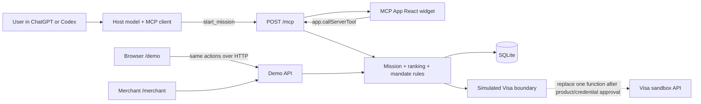

# Woven architecture

## Shape

Woven is deliberately one deployable Node.js service. ChatGPT/Codex, the browser fallback, and the merchant console all call the same domain and persistence functions.

There is no fake chat UI. The in-chat surface uses the standard MCP Apps bridge (`app.callServerTool`), while `/demo` is only a fallback transport for on-stage reliability.

## Tool contract

| Tool | Visibility | Effect |
| --- | --- | --- |
| `start_mission` | Model + app UI | Parse a mission, persist it, and return ranked carts |
| `build_carts` | Model + app UI | Recompute current carts from persisted inventory |
| `select_cart` | App only | Persist the user’s selected candidate |
| `create_checkout_preview` | App only | Revalidate and create an expiring exact mandate |
| `confirm_purchase` | App only | Verify explicit confirmation and execute simulator outcome |
| `get_order_status` | Model | Read the latest mission/order state |

The confirmation nonce is returned in MCP result `_meta`, not `structuredContent`, so it is private to the widget rather than visible to the model. Browser fallback receives it over same-origin HTTP because there is no model in that path.

## Cart algorithm

The canonical mission has four required categories: a USB-C PD charger, MacBook cable, iPhone/AirPods cable, and Japan plug adapter.

1. Apply scenario-adjusted inventory and price.
2. Reject zero-stock offers.
3. Reject chargers below 45W or without 100–240V input.
4. Reject cables whose connector or wattage cannot satisfy the assumed devices.
5. Build only complete carts from one merchant pickup location.
6. Reject carts over the hard budget.
7. Rank by power headroom, pickup time, then budget headroom.
8. Keep the best cart per merchant and label the top match and best value.

The seeded catalog is intentionally small, so direct enumeration is clearer and safer than a solver. If the catalog becomes large or missions gain optional/substitutable components, replace only `buildRankedCarts` with a constrained search implementation.

## Confirmation state machine

```mermaid
stateDiagram-v2
  [*] --> CartsReady: mission built
  CartsReady --> PreviewPending: review checkout
  PreviewPending --> PreviewPending: current cart still exact
  PreviewPending --> Stale: price / stock / cart version changed
  PreviewPending --> Expired: 10 minutes elapsed
  PreviewPending --> Confirmed: nonce + hash + idempotency valid; auth/order succeed
  PreviewPending --> Declined: simulated authorization decline
  PreviewPending --> Reversing: simulated merchant failure after auth
  Confirmed --> Confirmed: duplicate idempotency key returns same order
```

Checkout validates all of the following inside one SQLite write transaction:

- preview exists, is pending, and has not expired;
- nonce matches in constant time and has not been consumed;
- mandate hash matches the displayed terms;
- cart ID, version, exact amount, stock, and price still match;
- idempotency key is unique, or returns the already-created order;
- inventory decrements and order creation commit atomically.

## Trust boundaries

- No PAN, CVV, wallet token, or payment credential is accepted or stored.
- `PAYMENT_MODE` fails closed unless it is exactly `simulated`.
- Simulator outcomes and the UI are visibly labeled.
- CSV upload is capped at 200 KB, updates only known offer IDs, and validates price/stock.
- MCP resource CSP allows connections and assets only from `BASE_URL`.
- Express request JSON is capped at 256 KB and server identity headers are disabled.
- Demo reset is local and requires an explicit browser confirmation.

## Real Visa integration boundary

The safe replacement point is `authorizePayment` in `src/payment.ts`. A real sandbox adapter should be implemented only after choosing the exact Visa product and receiving sandbox credentials. It must preserve the current result contract, mandate/idempotency validation, audit events, timeout handling, reversal status, and the explicit confirmation UI. Production credentials must live in a secret manager, never the widget, repository, or MCP tool arguments.
