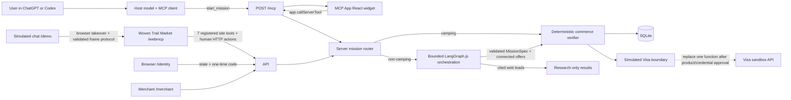
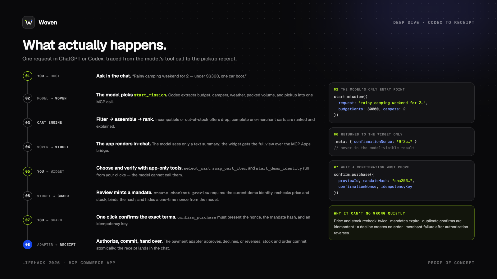
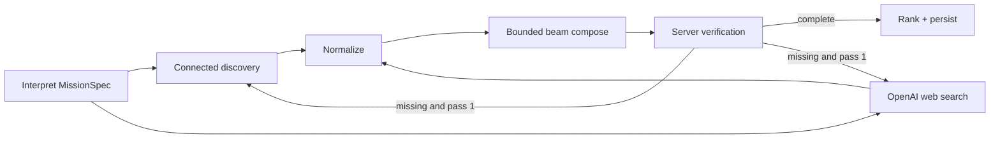

# Woven architecture

## Shape

Woven is deliberately one deployable Node.js service with distinct runtime
layers. ChatGPT/Codex, the WebMCP storefront, and the browser fallback enter
through MCP, WebMCP, or HTTP; the
server then routes the mission, optionally orchestrates non-camping discovery,
applies deterministic commerce verification, persists state, and enforces
checkout. MCP is the host/tool interface, not the orchestration engine.





The in-chat surface uses the standard MCP Apps bridge (`app.callServerTool`).
`/webmcp` is a dedicated light fictional storefront. It registers seven
imperative tools in the top-level document and maps them to the same HTTP API
and mission router used by its human mission composer. Its inline storefront
results and “Behind the cart” activity surface update from the returned public
`MissionView`. `/demo` remains the rehearsal transport for on-stage reliability:
it starts in the clearly labeled original LifeHack `Woven Demo Host` conversation, then lets
the same storefront take over a same-origin browser frame. After a person
submits, a narrow validated `postMessage` protocol asks the frame to run the real
showcase mission, scroll after the response, compare and select the best cart
through existing reversible actions, stop at the human-only handoff, and return
an exact public result summary to chat. The host owns presentation pacing: it
holds only observable states that have actually occurred, can pause or manually
advance those holds, and never pauses or fakes the mission request itself. A
same-origin internal `advance` message releases the framed storefront between
returned-result, comparison, selection, and handoff states. The host document registers no WebMCP tools, and the framed
storefront suppresses top-level registration; only a directly opened `/webmcp`
page exposes the seven tools. The direct page reports unsupported, registering,
connected, or failed and claims **WebMCP active** only after all seven
registrations resolve. The frame reports **WebMCP rehearsal active** instead.
Its activation receipt also states that the embedded frame does not register
tools and links to the real top-level `/webmcp` surface. When that direct page
runs without WebMCP support or registration fails, a solid notice points to the
two official testing paths: ChatGPT's in-app browser, or Google Chrome with
WebMCP enabled through its experimental flag or origin trial.
Neither browser route
impersonates a real host or performs live charges. Identity, exact revalidation,
private native merchant-cart creation, and merchant continuation are visible
direct-user controls on `/webmcp`, never site tools.

`/architecture` is a standalone interactive explanation of the current service
and the credential-gated target Visa boundary. Its tracer can autoplay or be
paused, and reduced-motion preferences disable autoplay by default.

With `?loop=true`, the simulated host replays chat submission, browser takeover,
real mission resolution, result scrolling, reversible cart selection, and the
return to chat. Seven deterministic presentation holds make the fast happy path
legible without changing backend timing; Pause/Resume affects those holds only,
and Next beat is unavailable while `start_mission` or `select_cart` is pending.
Each run visibly reaches the human-only handoff before returning.
It never starts identity, creates a
checkout preview, receives a confirmation nonce, or calls `confirm_purchase`.

The hosted MCP resource and `/demo` use explicit HTML entry points. `/demo`
loads `web/demo.tsx`; the MCP App loads `web/widget.tsx`. The hosted entry is
bundled into one self-contained HTML resource so sandboxed hosts do
not need to fetch scripts, styles, or fonts from localhost. It always
initializes the MCP Apps bridge and does not infer host mode from iframe nesting
because Codex may run the resource in a top-level sandboxed guest. In ChatGPT,
the hosted entry also hydrates from the current tool-output snapshot before
subscribing to later bridge results, so a cold first render does not require a
second prompt.

## Runtime layers

| Layer | Responsibility | Primary implementation |
| --- | --- | --- |
| Interaction and transport | MCP tool schemas, HTTP/stdio transport, browser API, React MCP App, guided simulated host, dedicated storefront, top-level-only WebMCP registration, human-only checkout visibility, private `_meta` | `src/server.ts`, `src/widget.ts`, `web/widget.tsx`, `web/demo.tsx`, `web/demo-protocol.ts`, `web/storefront.tsx`, `web/storefront-state.ts`, `web/webmcp.ts` |
| Mission routing and orchestration | Keep canonical camping deterministic; for other retail missions interpret `MissionSpec`, discover in parallel, normalize, compose, verify, optionally retry, and terminate within fixed bounds | `src/server.ts`, `src/open-world.ts` |
| Commerce verification | Decide requirement, compatibility, quantity, one-location, budget, stock, evidence, and checkout eligibility from typed server data | `src/domain.ts`, `src/open-world.ts` |
| State and checkout | Rebuild carts from current catalog rows, enforce identity and exact mandates, transact inventory/orders atomically, audit, and sign receipts | `src/store.ts` |
| Payment adapter | Return simulated approval, decline, failure, or reversal through the only approved replacement seam | `src/payment.ts` |

The host model may choose `start_mission`; it does not choose graph edges, mark
evidence verified, or authorize checkout. The graph coordinates bounded work,
while deterministic server code remains the authority for every commercial
claim and state transition.

## Tool contract

| Tool | Visibility | Effect |
| --- | --- | --- |
| `start_mission` | Model + app UI | Use deterministic camping or the bounded open-world workflow, persist the mission, and return verified carts plus optional research leads |
| `build_carts` | Model + app UI | Recompute current carts from persisted inventory |
| `select_cart` | App only | Persist the user’s selected candidate |
| `swap_cart_item` | App only | Rebuild the selected cart with an active merchant-approved alternative |
| `start_demo_identity` | App only | Start the simulated identity handoff; URL remains in private metadata |
| `create_checkout_preview` | App only | Require demo identity, revalidate, and create an expiring exact mandate |
| `confirm_purchase` | App only | Verify explicit confirmation and execute simulator outcome |
| `get_order_status` | Model | Read the latest mission/order state |
| `verify_receipt` | Model + app UI | Verify the HMAC signature on a simulated receipt |

The confirmation nonce and identity authorization URL are returned in MCP result
`_meta`, not `structuredContent`, so they are private to the widget rather than
visible to the model. Browser fallback receives them over same-origin HTTP
because there is no model in that path.

### WebMCP site-tool contract

| Tool | Effect |
| --- | --- |
| `start_mission` | Enter the same deterministic/open-world mission router used by MCP |
| `get_mission` | Read the current public mission view |
| `compare_carts` | Rerank the visible storefront kit comparison by priority or pickup area |
| `select_cart` | Persist one currently offered cart |
| `swap_cart_item` | Apply one current merchant-approved alternative and revalidate |
| `refresh_carts` | Rebuild public carts from current price and stock |
| `verify_receipt` | Verify a simulated receipt's server signature |

Every schema rejects additional properties. Registration is bound to an
`AbortSignal`, so navigation or remount removes the tools. The response headers
include `Origin-Agent-Cluster: ?1` and `Permissions-Policy: tools=(self)`.
There is intentionally no identity, preview, confirmation, or purchase tool;
those actions require the person in the visible interface.

The storefront defaults to live connectors and never substitutes seeded data.
One failed connector produces a degraded view that retains healthy verified
carts. Total failure remains an error with retry plus a direct explicit
showcase-data action. Client request sequence numbers and `AbortController`
prevent stale responses from overwriting newer work. Pending UI shows one
indeterminate operation; later proof steps remain pending until a real response.
The activity surface is a non-modal `aside`, not a dialog, and contains no
authorization control.

## Cart algorithm

The canonical mission has five required categories: a two-person tent, sleeping
bags, sleeping mats, a lantern, and first-aid supplies.

Every ranked cart also carries deterministic `metrics`: `unitCount`,
`categoryCount`, optional `packedLiters`, and optional `tentWaterproofMm`.
Both seeded and connected builders compute them from verified cart lines; the
canonical connected proof is 7 units, 5 categories, 89 L, and 3,000 mm. Because
views rebuild carts from stored offers, this additive field requires no database
migration.

1. Apply scenario-adjusted inventory and price.
2. Reject zero-stock offers.
3. Reject tents below two-person capacity or a 2,000 mm waterproof rating.
4. Require two damp-ready sleeping bags and two sleeping mats with R-value 1.5
   or better.
5. Require a 200-lumen IPX4 lantern and water-resistant first-aid supplies that
   cover two campers.
6. Reject any location without enough stock for every required quantity.
7. Reject carts whose packed volume exceeds the 120 L car-boot allowance.
8. Build only complete carts from one merchant pickup location.
9. Reject carts over the hard budget.
10. Rank by rain protection, pickup time, compactness, and budget headroom.
11. Keep the best cart per merchant, add distinct East and North location
    choices, and return the top five complete carts.
12. Attach only active merchant-approved alternative pairs that can be rebuilt
    into a complete, compatible, in-stock, under-budget cart at the same location.

The seeded catalog is intentionally small, so direct enumeration is clearer and safer than a solver. If the catalog becomes large or missions gain optional/substitutable components, replace only `buildRankedCarts` with a constrained search implementation.

## Bounded mission-orchestration POC

Non-camping requests use an implemented TypeScript orchestration POC inside the
existing service. LangGraph.js coordinates the stages; it does not replace MCP,
the commerce verifier, or checkout. The implementation adds
`@langchain/langgraph`, `@langchain/core`, and `openai`; there is no Python
process, queue, second database, or tracing service.



Routing and termination are code-selected, never model-selected. Each run is
limited to two discovery passes, three web-search tool calls, eight offers per
requirement, five final carts, 200 beam states, and 25 seconds. OpenAI requests
use the Responses API with `gpt-5.6-terra`, schema-constrained output,
`reasoning.effort: medium`, and `store: false`.

The validated `MissionSpec` contains quantities, hard attribute predicates,
cross-item compatibility links, preferences, assumptions, Singapore location,
SGD budget, and pickup date. Connected catalog records normalize into typed
offers with current price, stock, merchant/location, attributes, and provenance.
Composition groups by one merchant location, prunes missing attributes, stock,
budget, and incompatibility, then ranks the surviving carts. The server assigns
`checkoutEligible`; the model cannot set it.

Web search is a separate evidence class. Only cited HTTPS sources survive
normalization, and their products remain `researchLeads` with
`checkoutEligible: false`. They are never combined with connected offers and
never described as having verified current price, stock, or compatibility.

SQLite persists the sanitized spec, selected offer/requirement IDs, evidence
sources, research leads, and graph audit events. It does not persist model
reasoning, prompts, API keys, identity secrets, confirmation nonces in public
views, or payment data. Reads rebuild stored connected candidates from current
catalog rows, so the existing preview and confirmation checks remain
authoritative.

The workflow is credential-dormant by design. Without `OPENAI_API_KEY`, the
canonical camping engine and `/demo` continue normally while other missions
return retryable `AGENT_UNAVAILABLE`; no fallback invents results. The optional
`npm run eval:agent` command is excluded from CI and is the only live evaluation
path.

## Confirmation state machine

```mermaid
stateDiagram-v2
  [*] --> CartsReady: mission built
  CartsReady --> IdentityPending: review checkout
  IdentityPending --> CartsReady: verified short-lived session
  IdentityPending --> IdentityPending: missing / expired / reused code
  CartsReady --> PreviewPending: identity verified + review exact terms
  PreviewPending --> PreviewPending: current cart still exact
  PreviewPending --> Stale: price / stock / cart version changed
  Stale --> CartsReady: refresh and reopen Choice Center
  PreviewPending --> Expired: 10 minutes elapsed
  PreviewPending --> Confirmed: nonce + hash + idempotency valid; auth/order succeed
  PreviewPending --> Declined: simulated authorization decline
  PreviewPending --> Reversing: simulated merchant failure after auth
  Confirmed --> Confirmed: duplicate idempotency key returns same order
```



Checkout validates all of the following inside one SQLite write transaction:

- preview exists, is pending, and has not expired;
- the current, unexpired demo identity session matches the session and opaque
  subject bound into the mandate hash;
- nonce matches in constant time and has not been consumed;
- mandate hash matches the displayed terms;
- cart ID, version, exact amount, stock, and price still match;
- idempotency key is unique, or returns the already-created order;
- inventory decrements and order creation commit atomically.

Successful simulated orders include an HMAC-SHA256 receipt over the exact
mission, merchant, pickup, cart lines, amount, payment mode, and timestamp. The
per-database signing key lives in SQLite settings and never enters the widget;
`verify_receipt` compares both the stored and presented signatures in constant
time. This proves record integrity, not a live payment.

## Choice and substitution state

The Choice Center is a native `<dialog>` rendered by the existing MCP App. Its
priority and area reranking are presentation-only: checkout always consumes the
server cart ID and current server price. Browser preference storage is disabled
until the user checks the explicit remember box.

The `/webmcp` storefront does not reuse that dialog. It shows the best two kits
inline in solid cards and truthfully states when a larger seeded result was
reduced to two for the storefront. Selecting one scrolls to a separate solid
human-handoff section; the seven site tools cannot operate that section.

`merchant_alternatives` stores the merchant's active source/replacement pairs.
`mission_carts` stores offer IDs for a selected custom camping composition or
offer/requirement ID pairs for open-world connected candidates. Every read
rebuilds that composition through the applicable domain validator, so a
withdrawn, stale, incompatible, cross-location, out-of-stock, or over-budget
replacement disappears before preview or confirmation.

## Trust boundaries

- No PAN, CVV, wallet token, or payment credential is accepted or stored.
- `PAYMENT_MODE` fails closed unless it is exactly `simulated`.
- Simulator outcomes and the UI are visibly labeled.
- CSV upload is capped at 200 KB, updates only known offer IDs, and validates price/stock.
- MCP resource CSP allows connections and assets only from `BASE_URL`.
- Express request JSON is capped at 256 KB and server identity headers are disabled.
- Demo reset is local and requires an explicit browser confirmation.

## Implemented demo identity boundary

Woven enforces a simulated connector-style account check before
`create_checkout_preview`. It is not Visa OAuth, KYC, production identity
verification, or a real Visa login.

```text
Widget requests demo identity connection
    ↓
External demo consent page issues a short-lived, single-use code
    ↓
Server validates state + PKCE and creates an opaque identity session
    ↓
Checkout preview binds that subject to the existing exact terms
    ↓
The user still confirms the purchase separately
```

Only a safe status such as `verified`, the expiry, and an opaque display label
may reach the widget. Authorization codes and identity-session secrets remain
server-side and never enter MCP tool arguments or model-visible
`structuredContent`. Missing, expired, reused, or mismatched identity sessions
must fail before preview creation.

The widget refreshes pending identity state through the data-only `build_carts`
tool. That tool deliberately has no UI resource metadata, so ChatGPT and Codex
update the active iframe instead of remounting it. If the refreshed state is
still pending, the same action starts and opens a fresh private handoff URL.

This remains one-service functionality. `demo_identity_requests` holds the
server-only state, PKCE verifier, hashed authorization code, callback, and
expiry; `demo_identity_sessions` holds the opaque subject and 15-minute session.
Re-verification replaces the current session, so an older preview fails closed.

## Real Visa integration boundary

The relevant real product is Visa Intelligent Commerce: its sandbox includes
Visa Payment Passkey authentication, payment instructions, tokenization, and an
official MCP/reference implementation. Woven cannot enable it without Visa-issued
VTS, VIC, Token Requestor, MLE, and Visa Payment Passkey credentials. The safe
payment replacement point remains `authorizePayment` in `src/payment.ts`; a real
adapter must preserve the current result contract, mandate/idempotency validation,
audit events, timeout handling, reversal status, and explicit confirmation UI.
Production credentials belong in a secret manager, never the widget, repository,
or MCP arguments.
