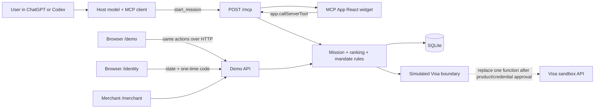

# Woven architecture

## Shape

Woven is deliberately one deployable Node.js service. ChatGPT/Codex, the browser fallback, and the merchant console all call the same domain and persistence functions.



The in-chat surface uses the standard MCP Apps bridge (`app.callServerTool`). `/demo` is a rehearsal transport for on-stage reliability: it renders a clearly labeled simulated chat host (marked “Simulated” in its header and footer) that drives the same backend over HTTP and surfaces each MCP tool call as it happens. It never impersonates a real host and performs no live charges.

`/architecture` is a standalone interactive explanation of the current service
and the credential-gated target Visa boundary. Its tracer can autoplay or be
paused, and reduced-motion preferences disable autoplay by default.

With `?loop=true`, the browser auto-advances the existing Choice Center controls,
compatibility proof, and approved-swap dialog, then completes the same simulated
identity state, PKCE, single-use-code, and callback flow used by the interactive
demo. It shows the verified state and host acknowledgement before fading and
reloading. The loop never creates a checkout preview, receives a confirmation
nonce, or calls `confirm_purchase`.

The hosted MCP resource and `/demo` use explicit HTML entry points. The hosted
entry is bundled into one self-contained HTML resource so sandboxed hosts do
not need to fetch scripts, styles, or fonts from localhost. It always
initializes the MCP Apps bridge and does not infer host mode from iframe nesting
because Codex may run the resource in a top-level sandboxed guest. In ChatGPT,
the hosted entry also hydrates from the current tool-output snapshot before
subscribing to later bridge results, so a cold first render does not require a
second prompt.

## Tool contract

| Tool | Visibility | Effect |
| --- | --- | --- |
| `start_mission` | Model + app UI | Parse a mission, persist it, and return ranked carts |
| `build_carts` | Model + app UI | Recompute current carts from persisted inventory |
| `select_cart` | App only | Persist the user’s selected candidate |
| `swap_cart_item` | App only | Rebuild the selected cart with an active merchant-approved alternative |
| `start_demo_identity` | App only | Start the simulated identity handoff; URL remains in private metadata |
| `create_checkout_preview` | App only | Require demo identity, revalidate, and create an expiring exact mandate |
| `confirm_purchase` | App only | Verify explicit confirmation and execute simulator outcome |
| `get_order_status` | Model | Read the latest mission/order state |
| `verify_receipt` | Model + app UI | Verify the HMAC signature on a simulated receipt |

The confirmation nonce and identity authorization URL are returned in MCP result
`_meta`, not `structuredContent`, so they are private to the widget rather than
visible to the model. Browser fallback receives them over same-origin HTTP
because there is no model in that path.

## Cart algorithm

The canonical mission has five required categories: a two-person tent, sleeping
bags, sleeping mats, a lantern, and first-aid supplies.

1. Apply scenario-adjusted inventory and price.
2. Reject zero-stock offers.
3. Reject tents below two-person capacity or a 2,000 mm waterproof rating.
4. Require two damp-ready sleeping bags and two sleeping mats with R-value 1.5
   or better.
5. Require a 200-lumen IPX4 lantern and water-resistant first-aid supplies that
   cover two campers.
6. Reject any location without enough stock for every required quantity.
7. Reject carts whose packed volume exceeds the 120 L car-boot allowance.
8. Build only complete carts from one merchant pickup location.
9. Reject carts over the hard budget.
10. Rank by rain protection, pickup time, compactness, and budget headroom.
11. Keep the best cart per merchant, add distinct East and North location
    choices, and return the top five complete carts.
12. Attach only active merchant-approved alternative pairs that can be rebuilt
    into a complete, compatible, in-stock, under-budget cart at the same location.

The seeded catalog is intentionally small, so direct enumeration is clearer and safer than a solver. If the catalog becomes large or missions gain optional/substitutable components, replace only `buildRankedCarts` with a constrained search implementation.

## Confirmation state machine

```mermaid
stateDiagram-v2
  [*] --> CartsReady: mission built
  CartsReady --> IdentityPending: review checkout
  IdentityPending --> CartsReady: verified short-lived session
  IdentityPending --> IdentityPending: missing / expired / reused code
  CartsReady --> PreviewPending: identity verified + review exact terms
  PreviewPending --> PreviewPending: current cart still exact
  PreviewPending --> Stale: price / stock / cart version changed
  Stale --> CartsReady: refresh and reopen Choice Center
  PreviewPending --> Expired: 10 minutes elapsed
  PreviewPending --> Confirmed: nonce + hash + idempotency valid; auth/order succeed
  PreviewPending --> Declined: simulated authorization decline
  PreviewPending --> Reversing: simulated merchant failure after auth
  Confirmed --> Confirmed: duplicate idempotency key returns same order
```



Checkout validates all of the following inside one SQLite write transaction:

- preview exists, is pending, and has not expired;
- the current, unexpired demo identity session matches the session and opaque
  subject bound into the mandate hash;
- nonce matches in constant time and has not been consumed;
- mandate hash matches the displayed terms;
- cart ID, version, exact amount, stock, and price still match;
- idempotency key is unique, or returns the already-created order;
- inventory decrements and order creation commit atomically.

Successful simulated orders include an HMAC-SHA256 receipt over the exact
mission, merchant, pickup, cart lines, amount, payment mode, and timestamp. The
per-database signing key lives in SQLite settings and never enters the widget;
`verify_receipt` compares both the stored and presented signatures in constant
time. This proves record integrity, not a live payment.

## Choice and substitution state

The Choice Center is a native `<dialog>` rendered by the existing MCP App. Its
priority and area reranking are presentation-only: checkout always consumes the
server cart ID and current server price. Browser preference storage is disabled
until the user checks the explicit remember box.

`merchant_alternatives` stores the merchant's active source/replacement pairs.
`mission_carts` stores only the offer IDs for a selected custom composition.
Every read rebuilds that composition through the same domain validator, so a
withdrawn, stale, incompatible, cross-location, out-of-stock, or over-budget
replacement disappears before preview or confirmation.

## Trust boundaries

- No PAN, CVV, wallet token, or payment credential is accepted or stored.
- `PAYMENT_MODE` fails closed unless it is exactly `simulated`.
- Simulator outcomes and the UI are visibly labeled.
- CSV upload is capped at 200 KB, updates only known offer IDs, and validates price/stock.
- MCP resource CSP allows connections and assets only from `BASE_URL`.
- Express request JSON is capped at 256 KB and server identity headers are disabled.
- Demo reset is local and requires an explicit browser confirmation.

## Implemented demo identity boundary

Woven enforces a simulated connector-style account check before
`create_checkout_preview`. It is not Visa OAuth, KYC, production identity
verification, or a real Visa login.

```text
Widget requests demo identity connection
    ↓
External demo consent page issues a short-lived, single-use code
    ↓
Server validates state + PKCE and creates an opaque identity session
    ↓
Checkout preview binds that subject to the existing exact terms
    ↓
The user still confirms the purchase separately
```

Only a safe status such as `verified`, the expiry, and an opaque display label
may reach the widget. Authorization codes and identity-session secrets remain
server-side and never enter MCP tool arguments or model-visible
`structuredContent`. Missing, expired, reused, or mismatched identity sessions
must fail before preview creation.

The widget refreshes pending identity state through the data-only `build_carts`
tool. That tool deliberately has no UI resource metadata, so ChatGPT and Codex
update the active iframe instead of remounting it. If the refreshed state is
still pending, the same action starts and opens a fresh private handoff URL.

This remains one-service functionality. `demo_identity_requests` holds the
server-only state, PKCE verifier, hashed authorization code, callback, and
expiry; `demo_identity_sessions` holds the opaque subject and 15-minute session.
Re-verification replaces the current session, so an older preview fails closed.

## Real Visa integration boundary

The relevant real product is Visa Intelligent Commerce: its sandbox includes
Visa Payment Passkey authentication, payment instructions, tokenization, and an
official MCP/reference implementation. Woven cannot enable it without Visa-issued
VTS, VIC, Token Requestor, MLE, and Visa Payment Passkey credentials. The safe
payment replacement point remains `authorizePayment` in `src/payment.ts`; a real
adapter must preserve the current result contract, mandate/idempotency validation,
audit events, timeout handling, reversal status, and explicit confirmation UI.
Production credentials belong in a secret manager, never the widget, repository,
or MCP arguments.
